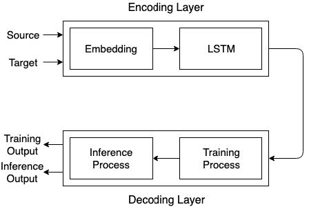
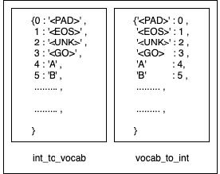
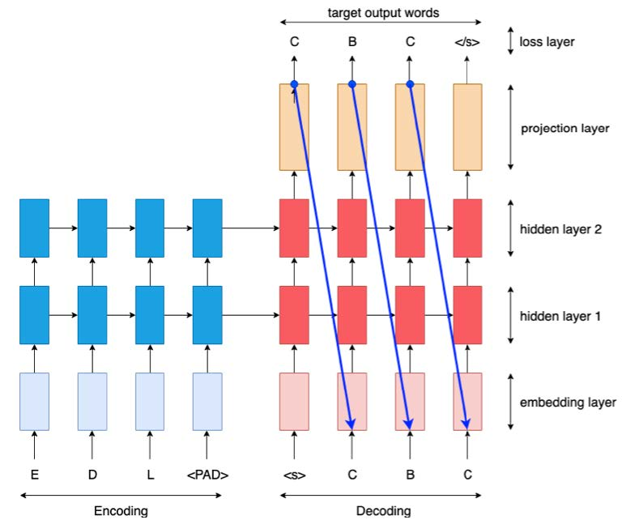
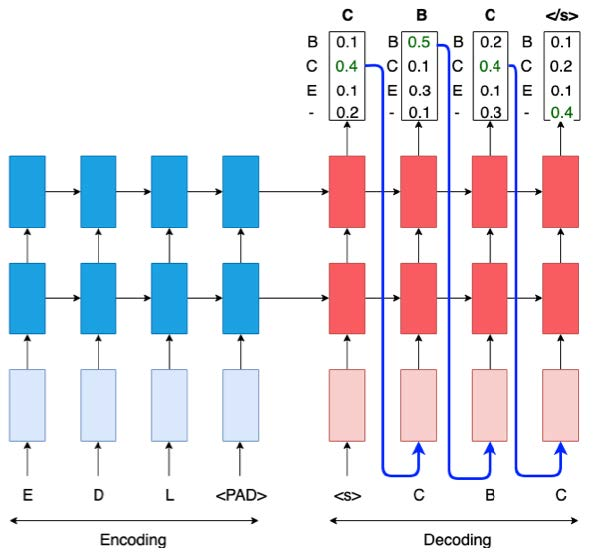
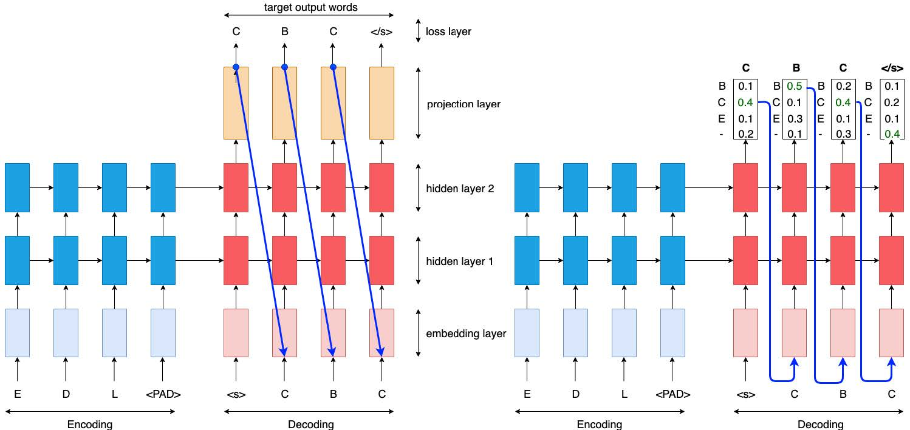
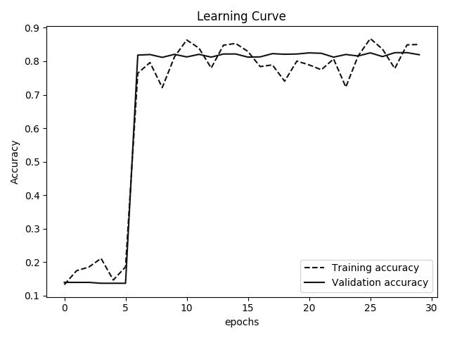
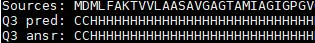

# Protein Secondary Structure (Q3, Q8) Prediction
## Introduction
　　Deep NLP process has been proved being very powerful to solve sequence problem. In this project, we treat predicting Q3 structure as the task of machine translation, so we use the classical seq2seq model to solve the problem with the believing that the protein sequence is like one kind of language.  
　　Although we didn't beat SOTA, however, the SOTA requires very complicate biological computation and uses Deep Convolutional Neural Fields (DeepCNF) to do the task. Our approach is relatively quite simple and intuitive. In the future, when we combine the knowledge and processing method of biology, we believe the approach will be very powerful.
## Material and Method
### Dataset
　　The dataset we use contains protein sequence with different lengths and its correct secondary structures. The length of the sequence ranges from 3 to 5037.  
　　For data preprocessing, we first clean up the dataset by deleting those which contains non-standard amino acids (*has_nonstd_aa = False*) and we get 386333 pieces of data. Then we randomly shuffled the whole dataset and choose **protein sequence** (column *seq*) **as source texts** and **Q3 structure** (*ssst3*) **as target texts**. For each text we choose 50000 pieces for training and testing.

### Model

#### Encoding Layer
We can separate encoding layer into two parts - embedding layer and RNN layers.
* Embedding Layer  
  　　First, we create **lookup tables** for source text and target text. Both table are created with special token: <PAD>, <GO>, <EOS>, <UNK> for padding, start of sequence, end of sequence, and unknown signature respectively. The tables help transform the sequence into integers and can also map integers to characters.  
  　　Later, we use lookup tables to transform both source and target character to integer then embed the integer sequence into 200 dimensional embedding latent space.  
  
* RNN Layers  
  　　Feeding the embedding result as input into LSTM with dropout (*keep_prob = 0.5*) to encode the information of sequence. We can change the LSTM cell into any other RNN cell, such as GRU, etc.
#### Decoding Layer
　　Decoding model can be thought of two separate processes, training and inference. They share the same architecture and parameters, but they have different strategy to feed the shared model.
* Training Part  
  　　The training part uses *dec_embed_input* as input, which is the output of *tf.nn.embedding_lookup (dec_embeddings, dec_input)*. This step manually creates embedding parameters for training phase to convert provided target data before the training runs.  
  
* Inference Part  
  　　For the inference process, whenever the output of current time step is calculated via decoder, it will be embedded by the shared embedding parameters (the parameter we created above) and become the input of next time step. Because we need to share the parameter, so we need to define a same variable scope and set *reuse = True*.  
  
#### Total Structure

## Evaluation
### Learning Curve

### Result
　　We use accuracy to evaluate the prediction by calculating the difference between each element of prediction and correct answer. Below is the input sequence, target sequence, and predicted result.  

## Discussion
　　We are surprised that by using a simple seq2seq model, we are able to predict the secondary structure without any biological computation and achieve 81% of accuracy. Tha accuracy is a little lower than the performance of SOTA. Maybe we can try bidirectional LSTM, unlike unidirectional LSTM, bidrectional LSTM preserves information from both past and future. And we can also try using pretained embedding model such as ELMO, GLoVe, etc. to achieve better performance.
